# Diagrama de Blocos do Sistema: OdontoSys

Este documento apresenta a arquitetura e o diagrama de blocos básico do **OdontoSys**, descrevendo como os módulos se organizam em camadas e como as informações trafegam entre a interface de usuário, as regras de negócio e os arquivos físicos de armazenamento.

---

## Diagrama de Blocos Arquitetural

O sistema é dividido em **4 camadas principais**:

---

## Descrição das Camadas e Componentes

### 1. Camada de Apresentação (GUI)
* **Componente:** Pasta `src/gui/*.c` e cabeçalho `include/gui.h`
* **Função:** Modulariza o controle da interface de usuário gráfica utilizando GTK4. Cada tela possui seu próprio arquivo `.c` dedicado (ex: `gui_login.c`, `gui_dashboard.c`, `gui_pre_diagnostico.c`). O módulo constrói os layouts, renderiza os botões/textos, captura as interações do dentista e se comunica com o restante do sistema conectando os dados extraídos das entradas visuais às structs de domínio e variáveis de estado.

### 2. Camada de Lógica & Estado (Core)
* **`main.c` (Raiz do Projeto):** Arquivo central que inicializa todas as peças do sistema em ordem (Logs, e Framework GTK) e lança o loop principal da aplicação.
* **`app.c` / `app.h`:** Gerencia as funções de inicialização, configurações base e o ciclo de vida do GTK (`GtkApplication`).
* **`dentist.c` / `patient.c` / `clinical.c`:** Contêm as regras de negócio de cada entidade. O arquivo `clinical.c`, em específico, abriga a inteligência cefalométrica e a árvore de decisão responsável por processar as medidas informadas, cruzar dados biológicos e formular o laudo de pré-diagnóstico final.

### 3. Camada de Dados (Database)
* **Componente:** `database.c` / `database.h`
* **Função:** É o motor de persistência. Traduz as estruturas de memória do C (`Dentist`, `Patient` e `ClinicalRecord`) para linhas de arquivos de texto formatados em **CSV** delimitados por ponto-e-vírgula (`;`). As chaves primárias e estrangeiras são baseadas em inteiros sem sinal de 64 bits (`uint64_t`).
* **`database/dentists.csv`:** Armazena o cadastro e as credenciais de login dos profissionais dentistas (`dentist_id`).
* **`database/pacientes.csv`:** Armazena exclusivamente o cadastro básico de pacientes (`patient_id`).
* **`database/prontuarios.csv`:** Armazena o prontuário de atendimentos e os diagnósticos gerados vinculados aos IDs do paciente e dentista (`clinical_id`).

### 4. Camada Auxiliar (Logs)
* **Componente:** `logs.c` / `logs.h`
* **Função:** Grava de forma segura e padronizada (com carimbos de data/hora) todas as ações relevantes do sistema.
* **`logs/app.log`:** Arquivo físico que documenta desde inicializações com sucesso até alertas de segurança ou falhas críticas de acesso ao disco.
